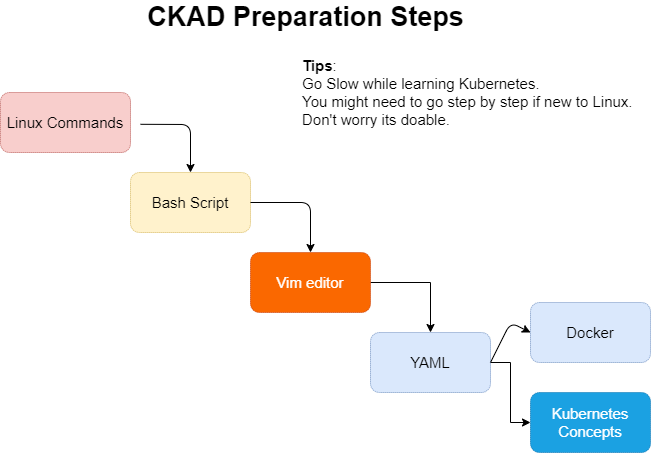

# CKAD - Certified Kubernetes Application Developer

## ***Prepation Guide*** by ***Wriju Ghosh*** ([@wrijugh](https://twitter.com/wrijugh))

## Introduction

There are handful of CKAD professionals today. However probably there are few hundred resources explaining about their own experiences on this intense hands-on exam. Then the question might arise why yet another such guide. I would try to justify the reason behind my intention to put together the content.

I think it might be helpful for the people like me around. I come from Windows background. I have a very limited experience working on Linux. However, I've been fortunate enough to work with my customers helping move their workloads in cloud managed Kubernetes platform. Also, my organization arranges hands-on OpenHack events to help experience the real-life example on Kubernetes deployment. I’ve learned a bit while working as well as understood that conceptually I'm far behind to really understand why one over another. I started digging into the concepts of Kubernetes and slowly explore things like I never knew before. Then I realized that to validate my working experience with the concept from my learning needs a validation. Let me try the well-known and well-recognized exam i.e., Certified Kubernetes Application Developer aka, CKAD. Because this will not only ensure my knowledge gap but also recognize the effort if I'm putting it in the right direction.

It's a journey by all means. Even in the toughest circumstances if I could not clear the exam after multiple try, I would have been happy to have it prepared because while preparing I’ve learned and cleared many of my vague understanding about the main Kubernetes platform. That's why I would like to call it as **journey that matters**.  

## Some facts about CKAD

- CKAD has a word *developer*. But his does not ask you to write any application or configure. Hence anybody can sit for this exam and no matter whether you come from a development background or not. I think CNCF may consider renaming this “developer” into something like “DevOps” this will help reduce the confusion.
- This is a **performance-based** exam. A browser-based console will be given to work on. There is no need to install any additional software apart from a small extension for the Chrome or Chromium browser.
- For the exam environment details and candidate Handbook please visit the official [CNCF portal](https://www.cncf.io/certification/ckad/) for the most up-to-date details. I would highly recommend not to rely on any individual, independent or third party blog about the exam environment, because the information can go outdated. 
  - [Candidate Handbook](https://docs.linuxfoundation.org/tc-docs/certification/lf-candidate-handbook)
  - [Curriculam](https://github.com/cncf/curriculum) - refer this for latest one
  - Very useful [Exam Tips](https://docs.linuxfoundation.org/tc-docs/certification/tips-cka-and-ckad)
- **Practice** **Practice** **Practice** - key to the success. Once you are comfortable solving the problems go for time bound practice. Use stopwatch and solve as quickly as possible. If you are well prepared then probably there is no proble which you can't solve. **Time management** is the key.

## Steps to prepare

Since the exam happens in a Linux terminal having an understanding and comfort working with Linux is the key success factor here. You need to be comfortable with basic Linux commands, simple bash scripts, and the most important of all is very comfortable with Vim editor. If you struggle during the exam while copying a content from documentation to Vim and format is damaged, then you will be losing out your precious time. So get used to with Vim and try to be faster as much as possible. There are a lot of tips and tricks available online go through some of them as you are working on to editing/modifying YAML files.

If you are already a seasoned Linux user then you may skip the below step and go directly to the core Kubernetes Objects and Concepts.  

I have design the below steps keeping in mind that the candidate it's not comfort working with Linux. Either they come from pure Windows background or new to Linux world.

*Now let's handle them one by one:*

## Basic Linux Commands

You will encounter often times with the Linux command prompt. Because the CKAD exam uses one of the Linux distributions. If you happen to not come from the Linux world it'll be intimidating. You might  get stuck on few things due to the lack of practice. Hence it is absolutely important to feel comfortable with Linux commands, at least the basic file handling etc.

- [Create folders and files](https://ubuntu.com/tutorials/command-line-for-beginners#4-creating-folders-and-files)
- [Moving and manipulating files](https://ubuntu.com/tutorials/command-line-for-beginners#5-moving-and-manipulating-files)

<iframe width="560" height="315" src="https://www.youtube.com/embed/u-qwznq_TaA" frameborder="0" allow="accelerometer; autoplay; clipboard-write; encrypted-media; gyroscope; picture-in-picture" allowfullscreen></iframe>

[Direct Video Link](https://youtu.be/u-qwznq_TaA)

## Basic Shell Scripting

Bash script or Shell script it's not that important but it keeps popping up while you work on container. For example, you might need to run a command which will keep your container running for 3600 seconds. If you know bash script, then you know there is command called sleep followed by the number of specified well keep your interactive terminal wedding for the specified seconds. These are not very in-depth automation kind of script you have to understand but good to know some basic Shell scripts construct which will help you during the exam as well as while working with Kubectl.

[**Shell Scripting Tutorial**](https://www.tutorialspoint.com/unix/shell_scripting.htm)

<iframe width="560" height="315" src="https://www.youtube.com/embed/CdY5gb1wqLs" frameborder="0" allow="accelerometer; autoplay; clipboard-write; encrypted-media; gyroscope; picture-in-picture" allowfullscreen></iframe>

[Direct Video Link](https://youtu.be/CdY5gb1wqLs)

## Vim Editor

Vim or Vi modified is the default editor for Linux operating system. Unlike other text editors like notepad, sublime, notepad++, word processor – Vim plays in a completely different world. People coming from non Linux background using Windows for the first time can get frustrated with the weird behavior. But for a seasoned Linux users it is the most efficient editors ever available in Linux. If you happen to see a Linux user working on vim, you will be amazed to see how fast it can go. If you know the tricks you can do magic. In this short video I tried to demonstrate the capabilities from a purely Windows user perspective. Hope you will enjoy this will too.

[**Vim Cheat Sheet**](https://vim.rtorr.com/)

<iframe width="560" height="315" src="https://www.youtube.com/embed/kkjGsswEDD0" frameborder="0" allow="accelerometer; autoplay; clipboard-write; encrypted-media; gyroscope; picture-in-picture" allowfullscreen></iframe>

[Direct Video Links](https://youtu.be/kkjGsswEDD0)

## Intro to YAML

I found this nice 18 min video from Nana. I recommend we all watch this. This basic understanding would help. Because it is the backbone of Kubernetes.

[**YAML.org**](https://yaml.org/spec/1.2/spec.html)

[**Introduction to YAML - by Wriju**](YAML-Intro.md)

<iframe width="560" height="315" src="https://www.youtube.com/embed/1uFVr15xDGg" frameborder="0" allow="accelerometer; autoplay; clipboard-write; encrypted-media; gyroscope; picture-in-picture" allowfullscreen></iframe>

[Direct Video Link](https://youtu.be/1uFVr15xDGg)

## Docker Basics

Kubernetes runs container. But it is not mandatory to have only docker as its container runtime. The default comes with docker. However, Kubernetes manages Pod not the container. Having a little bit of idea about how Docker container works could help clarify some of the command line activities to understand the basics. Let's have a small video.

[**Introduction to Docker containers**](https://docs.microsoft.com/en-us/learn/modules/intro-to-docker-containers/)

<iframe width="560" height="315" src="https://www.youtube.com/embed/OFiDKX1570Y" frameborder="0" allow="accelerometer; autoplay; clipboard-write; encrypted-media; gyroscope; picture-in-picture" allowfullscreen></iframe>

[Direct Video Link](https://youtu.be/OFiDKX1570Y)

---

## Kubernetes under 10 minutes

CKAD exam is a performance-based exam. That means you will be given Linux console and asked to solve certain problems. There is no objective type question. This means you not only have two know hands on about Kubernetes but also be very comfortable and quick in solving the problems. In this section I will try to share some of the tips and tricks of using Kubectl and configuring few basic stuff.

## Kubernetes CKAD Tips 1 - Using Katacoda - A free Kubernetes Playground

[Katacoda](http://katacoda.com) is a nice place to start with Kubernetes. It is a browser-based playground and does not require any local installation. One can start immediately without spending much time on setting up the Kubernetes locally or in a VM.

This video talks about how we can use Katacoda.

<iframe width="560" height="315" src="https://www.youtube.com/embed/k_zsnPj1VrM" frameborder="0" allow="accelerometer; autoplay; clipboard-write; encrypted-media; gyroscope; picture-in-picture" allowfullscreen></iframe>

[Direct Video Link](https://youtu.be/k_zsnPj1VrM)

## Kubernetes CKAD Tips 2 - Breaking the myths - CKAD does not require programming knowledge

CKAD (Certified Kubernetes Application Developer) the word "Developer" does not mean that it will ask you to write code. If you have no development experience and never done any programming then don't worry - none of those skills are required here. So have a look into the CNCF's official curriculum and jump into it.

<iframe width="560" height="315" src="https://www.youtube.com/embed/25VKXVzhIz4" frameborder="0" allow="accelerometer; autoplay; clipboard-write; encrypted-media; gyroscope; picture-in-picture" allowfullscreen></iframe>

[Direct Video Link](https://youtu.be/25VKXVzhIz4)

## Kubernetes CKAD Tips 3 - Pod and Container

In Kubernetes we need to manage Pod which hosts the container(s). In Kubernetes what is the relationship between pod and container? The concept of Pod is unique in Kubernetes. Let's understand it a bit.

<iframe width="560" height="315" src="https://www.youtube.com/embed/aq7dLCpsO20" frameborder="0" allow="accelerometer; autoplay; clipboard-write; encrypted-media; gyroscope; picture-in-picture" allowfullscreen></iframe>

[Direct Video Link](https://youtu.be/aq7dLCpsO20)

## Kubernetes CKAD Tips 4 - Troubleshooting Pods

When you create a Pod it generally gets created if the syntax is correct. At least the CLI says so. It is mainly because the Kubernetes API checks everything and accepts the instruction. Later the Kubernetes schedular picks it up and deploys. By the time it is accepted to the time it is deployed many things could happen. Also, if the image used in Pod’s container is wrong Kubernetes API can’t figure it out unless it deploys it. So, it gets to know about the image unavailability during the creation process. Also, there could be an issue with available CPU and memory of the Node. Let’s see the different ways to build and deploy the Kubernetes Pod and if any problem how to find it out and can be sorted.

<iframe width="560" height="315" src="https://www.youtube.com/embed/w4BGWdMCx88" frameborder="0" allow="accelerometer; autoplay; clipboard-write; encrypted-media; gyroscope; picture-in-picture" allowfullscreen></iframe>

[Direct Video Link](https://youtu.be/w4BGWdMCx88)

## Kubernetes CKAD Tips 5 – Namespaces

Kubernetes supports multiple virtual clusters backed by the same physical cluster. These virtual clusters are called namespaces.
Names of the resources within a Namespace should be unique. Namespaces cannot be nested.

<iframe width="560" height="315" src="https://www.youtube.com/embed/F7dcyUXbbEY" frameborder="0" allow="accelerometer; autoplay; clipboard-write; encrypted-media; gyroscope; picture-in-picture" allowfullscreen></iframe>

[Direct Video Link](https://youtu.be/F7dcyUXbbEY)

## Kubernetes CKAD Tips 6 – Configuring Kubectl context

Often time we work with multiple Kubernetes clusters and namespaces from a single console. Hence switching between the clusters and console is important. Let’s learn few **kubectl** command to do it switching.

<iframe width="560" height="315" src="https://www.youtube.com/embed/PkyKI_-nIMM" frameborder="0" allow="accelerometer; autoplay; clipboard-write; encrypted-media; gyroscope; picture-in-picture" allowfullscreen></iframe>

[Direct Video Link](https://youtu.be/PkyKI_-nIMM)
## Kubernetes CKAD Tips 7 – Getting help

In my opinion Kubernetes CLI documentation is the best. You get pretty much everything you need including the syntax help with examples. Let’s learn how to use the CLI help.

<iframe width="560" height="315" src="https://www.youtube.com/embed/_rTWoRmbgCY" frameborder="0" allow="accelerometer; autoplay; clipboard-write; encrypted-media; gyroscope; picture-in-picture" allowfullscreen></iframe>

[Direct Video Link](https://youtu.be/_rTWoRmbgCY)
## Kubernetes CKAD Tips 8 – Deployments

A Deployment provides declarative updates for Pods and ReplicaSets.
You describe a desired state in a Deployment, and the Deployment Controller changes the actual state to the desired state at a controlled rate. You can define Deployments to create new ReplicaSets, or to remove existing Deployments and adopt all their resources with new Deployments.

<iframe width="560" height="315" src="https://www.youtube.com/embed/KuSc9yPjcyw" frameborder="0" allow="accelerometer; autoplay; clipboard-write; encrypted-media; gyroscope; picture-in-picture" allowfullscreen></iframe>

[Direct Video Link](https://youtu.be/KuSc9yPjcyw)

## Kubernetes CKAD Tips 9 – Rolling Updates in Deployment

In a real production environment, we don't manage Pods rather Kubernetes deployment manages the Pods. However, if there is a change or update required, we prefer not to shut down the whole environment but rather roll it over slowly. If you have four replicas then probably it will take down one at a time and update 4 pods one after another, rather than doing altogether. This purely depends on the requirement of your application, if you don't want to have any older version running while updating the newer version, you can have the complete update without choosing the rollout kind of behavior.

<iframe width="560" height="315" src="https://www.youtube.com/embed/mntc_h6nKAc" frameborder="0" allow="accelerometer; autoplay; clipboard-write; encrypted-media; gyroscope; picture-in-picture" allowfullscreen></iframe>

[Direct Video Link](https://youtu.be/mntc_h6nKAc)

## Kubernetes CKAD Tips 10 – Labels

Labels in Kubernetes are a very humble but important component. Through labels Kubernetes objects like deployment, services are connected to the core component Pod. Labels are not mandatory. You can create an object without a Label. Labels can be added or modified later as well. Together with selector label helps connect loosely coupled objects.

<iframe width="560" height="315" src="https://www.youtube.com/embed/AE1ZiIizH4Q" frameborder="0" allow="accelerometer; autoplay; clipboard-write; encrypted-media; gyroscope; picture-in-picture" allowfullscreen></iframe>

[Direct Video Link](https://youtu.be/AE1ZiIizH4Q)

## Kubernetes CKAD Tips 11 – Annotations

You can use Kubernetes annotations to attach arbitrary non-identifying metadata to objects. Clients such as tools and libraries can retrieve this metadata.
You can use either labels or annotations to attach metadata to Kubernetes objects. Labels can be used to select objects and to find collections of objects that satisfy certain conditions. In contrast, annotations are not used to identify and select objects. The metadata in an annotation can be small or large, structured or unstructured, and can include characters not permitted by labels.

## Kubernetes CKAD Tips 12 – Jobs

A Job creates one or more Pods and will continue to retry execution of the Pods until a specified number of them successfully terminate. As pods successfully complete, the Job tracks the successful completions. When a specified number of successful completions is reached, the task (ie, Job) is complete. Deleting a Job will clean up the Pods it created.

## Kubernetes CKAD Tips 13 – CronJobs

A CronJob creates Jobs on a repeating schedule.
