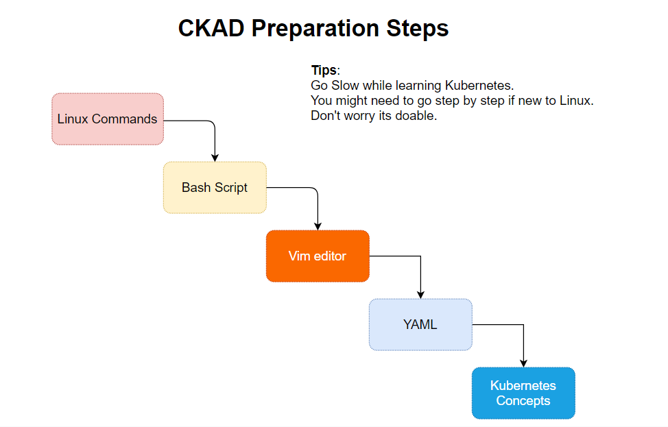

# Certified Kubernetes Application Developer aka CKAD

## Prepation Guide

## Introduction

There are handful of CKAD professionals today. However probably there are few hundred resources explaining about their own experiences on this intense hands-on exam. Then the question might arise why yet another such guide. I would try to justify the reason behind my intention to put together the content.

I think it might be helpful for the people like me around. I come from Windows background. I have a very limited experience working on Linux. However, I've been fortunate enough to work with my customers helping move their workloads in cloud managed Kubernetes platform. Also, my organization arranges hands-on OpenHack events to help experience the real-life example on Kubernetes deployment. I’ve learned a bit while working as well as understood that conceptually I'm far behind to really understand why one over another. I started digging into the concepts of Kubernetes and slowly explore things like I never knew before. Then I realized that to validate my working experience with the concept from my learning needs a validation. Let me try the well-known and well-recognized exam i.e., Certified Kubernetes Application Developer aka, CKAD. Because this will not only ensure my knowledge gap but also recognize the effort if I'm putting it in the right direction.

It's a journey by all means. Even in the toughest circumstances if I could not clear the exam after multiple try, I would have been happy to have it prepared because while preparing I’ve learned and cleared many of my vague understanding about the main Kubernetes platform. That's why I would like to call it as **journey that matters**.  

## Some facts about CKAD

- CKAD has a word *developer*. But his does not ask you to write any application or configure. Hence anybody can sit for this exam and no matter whether you come from a development background or not. I think CNCF may consider renaming this “developer” into something like “DevOps” this will help reduce the confusion.
- This is a **performance-based** exam. A browser-based console will be given to work on. There is no need to install any additional software apart from a small extension for the Chrome or Chromium browser.
- For the exam environment details and candidate Handbook please visit the official [CNCF portal](https://www.cncf.io/certification/ckad/) for the most up-to-date details. I would highly recommend not to rely on any individual, independent or third party blog about the exam environment, because the information can go outdated. 
  - [Candidate Handbook](https://docs.linuxfoundation.org/tc-docs/certification/lf-candidate-handbook)
  - [Curriculam](https://github.com/cncf/curriculum) - refer this for latest one
  - Very useful [Exam Tips](https://docs.linuxfoundation.org/tc-docs/certification/tips-cka-and-ckad)
- **Practice** **Practice** **Practice** - key to the success. Once you are comfortable solving the problems go for time bound practice. Use stopwatch and solve as quickly as possible. If you are well prepared then probably there is no proble which you can't solve. **Time management** is the key.

## Steps to prepare
Since the exam happens in a Linux terminal having an understanding and comfort working with Linux is the key success factor here. You need to be comfortable with basic Linux commands, simple bash scripts, and the most important of all is very comfortable with Vim editor. If you struggle during the exam while copying a content from documentation to Vim and format is damaged, then you will be losing out your precious time. So get used to with Vim and try to be faster as much as possible. There are a lot of tips and tricks available online go through some of them as you are working on to editing/modifying YAML files.

If you are already a seasoned Linux user then you may skip the below step and go directly to the core Kubernetes Objects and Concepts.  

I have design the below steps keeping in mind that the candidate it's not comfort working with Linux. Either they come from pure Windows background or new to Linux world.

